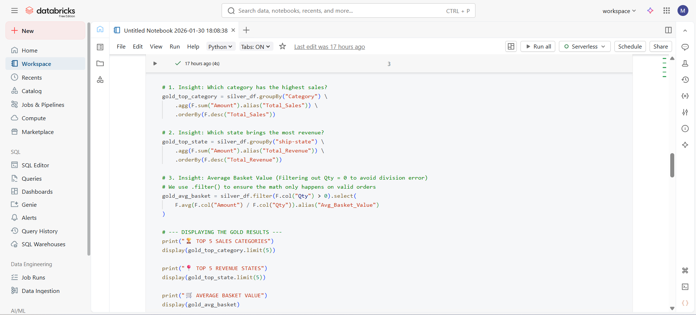

# 🌐 Multi-Cloud Data Engineering Pipeline: Amazon Sales Analysis
### AWS S3 + Databricks Spark + Google BigQuery Omni

## 📖 Project Overview
This project demonstrates a production-grade **Multi-Cloud Data Engineering** workflow. I built a scalable pipeline that ingests, cleans, and analyzes Amazon Sales data using a **Medallion Architecture**. The project highlight is the use of **BigQuery Omni**, which allows for serverless SQL analytics in Google Cloud on data physically stored in AWS S3, bypassing expensive data egress and migration.

---

## 🏗️ Architecture & Workflow

1.  **Data Ingestion (AWS S3):** Raw Amazon sales data is landed in an S3 **Bronze** bucket.
2.  **Automation (SNS):** Implemented S3 Event Notifications to trigger **AWS SNS** (Simple Notification Service) email alerts upon new file uploads.
3.  **ETL Processing (Databricks + PySpark):** * **Bronze to Silver:** Data cleaning, deduplication, and schema enforcement.
    * **Silver to Gold:** Business logic application, generating high-value aggregated tables (Revenue by Category).
4.  **Multi-Cloud Analytics (BigQuery Omni):** Established a secure OIDC Trust Relationship between GCP and AWS to query the Gold Parquet files directly from S3 using BigLake tables.

---

## 🛠️ Technical Stack
* **Storage:** Amazon S3 (Data Lake)
* **Compute:** Databricks (Spark SQL & PySpark)
* **Orchestration:** AWS SNS (Simple Notification Service)
* **Analytics:** Google BigQuery Omni & BigLake
* **Security:** IAM Roles, OIDC Trust, and Cross-Cloud Identity Management

---

## 🚀 Key Implementation Steps

### 1. The Medallion Pipeline (Databricks)
I used PySpark to transform raw CSV data into optimized, columnar Parquet files. This ensures high-performance querying and reduced storage costs.

**[image/Databricks Queries.png]**

*Caption: PySpark ETL logic in Databricks transforming raw data into the Gold business layer.*

### 2. Real-Time Notifications (AWS SNS)
To ensure immediate data awareness, I configured an SNS topic that sends an email notification the moment a new dataset is uploaded to the S3 bucket.

**[images/AWS SNS.png]**
*Caption: Automated email notification received via AWS SNS.*

### 3. BigQuery Omni Analytics (GCP)
The most innovative part of the project: I enabled the BigQuery Omni engine to "reach over" to AWS. By setting the BigQuery dataset location to `aws-us-east-1`, I performed SQL analytics on AWS data without moving a single byte to GCP.

**[images/BigQuery result.png]**
*Caption: SQL query results in BigQuery showing live data being pulled from AWS S3.*

### And much more screenschots in images folder.

---

## 📊 Final Business Insights
Using the Gold layer in BigQuery, I executed analytical queries to extract key performance indicators (KPIs):

```sql
-- Analyzing Revenue by Product Category across clouds
SELECT 
  Category, 
  ROUND(SUM(Amount), 2) as Total_Revenue,
  COUNT(Order_ID) as Order_Count
FROM `my-omni-project.amazon_sales_data.amazon_sales_gold`
GROUP BY 1
ORDER BY Total_Revenue DESC;

---

## 🏁 Conclusion
This project proves the power of interoperability in modern data stacks. By combining AWS's storage reliability with Google Cloud's analytical power, I created a cost-effective, high-performance architecture that solves the "Data Silo" problem.


## 📂 Repository Structure
/notebook: PySpark ETL notebook.

/sql: BigQuery table definitions and analytical queries.

/config: IAM Policy JSON files and Trust Relationships.

/images: Screenshots.

/data: Raw csv file. 
